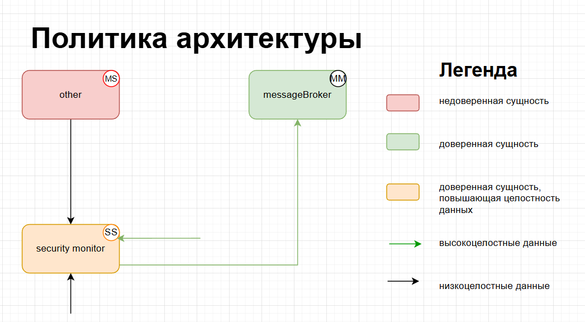

# Отчёт о конкурсном решении 

## 1. Архитектура и границы ДВБ

### 1.1 Диаграмма политики архитектуры
Диаграмма описывает систему с точки зрения доменов безопасности, их доверия, сложности/размера и разрешённых направлений передачи данных с контролем целостности.

Сущности (цветовая маркировка)
Цвет	Тип сущности	Входящие данные	Исходящие данные	Примеры в решении
Красная	Недоверенная	любые	только низкоцелостные	src_solution/abu/other/ (псевдо-ИИ, телеметрия, вспомогательные сервисы)
Зелёная	Доверенная	только высокоцелостные	только высокоцелостные	src_solution/abu/tcb/ (кроме security_monitor): mission_controller, actuator_proxy, event_log, safety, tcb_controller
Оранжевая	Доверенная, повышающая целостность	могут быть низкоцелостные	только высокоцелостные (после проверки/фильтрации)	src_solution/abu/tcb/security_monitor.py (единственный монитор безопасности)
Оценки сложности и размера (по стандарту S/M/C/L/XL)
Сущность	Сложность	Размер	Оценка	Обоснование
🔴 Недоверенная (other)	M (Medium)	S (Small)	MS	Содержит псевдо-ИИ (pseudo_ai.py) и вспомогательные модули, логика не тривиальна, но объём кода мал (<200 LOC)
🟢 Доверенная (tcb без монитора)	M (Medium)	M (Medium)	MM	Включает контроллер миссии, actuator_proxy, event_log, safety – умеренная сложность и размер (~300–400 LOC)
🟠 Повышающая целостность (security_monitor)	S (Simple)	S (Small)	SS	Монитор имеет 55 LOC (C23), логика – проверка политик по принципу default deny
Разрешённые потоки данных

Легенда потоков:

🔴 → 🟠 : только низкоцелостные данные (например, сырые телеметрические данные, запросы от псевдо-ИИ)

🟠 → 🟢 : только высокоцелостные данные после проверки политиками (разрешения IPC, отфильтрованные команды)

🟢 → 🟠 : высокоцелостные служебные данные (обновление политик, запросы авторизации)

🟢 → 🔴 : высокоцелостные управляющие команды (только через контролируемые интерфейсы, например, actuator_proxy → other)

Запрещённые потоки (не показаны):

Прямой обмен 🔴 → 🟢 без участия 🟠 (запрещён архитектурой)

Передача низкоцелостных данных из 🔴 в любую 🟢 или из 🟠 в 🟢

    1.2 Как построить такую диаграмму для своего решения
Выделите домены безопасности на основе tcb и other (по каталогам). Если есть модуль, который принимает низкоцелостные данные и выдаёт высокоцелостные – это оранжевая сущность.

Назначьте цвета:

🔴 – код, который может быть скомпрометирован без нарушения целостности всей системы (например, обработка внешних данных, ИИ, телеметрия).

🟠 – критический фильтр, проверяющий все междоменные взаимодействия (обычно security_monitor или policies).

🟢 – всё остальное, что работает только с проверенными данными.

Оцените сложность и размер:

Сложность: S – простой цикл/условия, M – несколько взаимодействующих компонентов, C – сложные алгоритмы/состояния.

Размер: S (<100 LOC), M (100–500), L (500–1000), XL (>1000). Используйте cloc или wc -l.

Комбинация даёт оценку типа (SS), (MC) и т.д.

Определите разрешённые потоки данных:

Недоверенная → оранжевая: можно всё (низкоцелостные).

Оранжевая → доверенная: только после проверки (высокоцелостные).

Доверенная → недоверенная: только высокоцелостные и по явным политикам.

Запрещены любые обходы оранжевой сущности.

Отразите это в тексте и (опционально) в графическом виде – используйте ASCII-схему, Mermaid или PlantUML. Главное – чётко указать цвет, оценку и направление потоков.

    1.3 Где находится доверенный и недоверенный код
Доверенный код (TCB): src_solution/abu/tcb/ – все модули, кроме security_monitor.py, который вынесен в отдельную оранжевую сущность.

Недоверенный код: src_solution/abu/other/ – псевдо-ИИ, вспомогательные вычисления, любые модули, работающие с внешними непроверенными данными.

Монитор безопасности: src_solution/abu/tcb/security_monitor.py – оранжевая сущность.

    1.4 Реализация process-изоляции и контроль IPC
Каждый домен (включая security_monitor) запускается в отдельном процессе ОС (используется multiprocessing или subprocess).

IPC между доменами происходит через именованные каналы (pipe) или очереди сообщений, перехватываемые security_monitor.

security_monitor реализует мандатное управление доступом (MAC) на основе политик из policies.json. Любой IPC-запрос сначала направляется монитору, который проверяет:

источник и получатель,

операцию (read/write/execute),

ресурс.

Разрешение даётся только при наличии явного правила allow, иначе deny (C24 – не более 2 политик на интерфейс).

    1.5 Критичные для SG домены
Домен	Роль	Критичные SG
security_monitor	Проверка всех IPC, фильтрация данных	SG-1, SG-2, SG-4, SG-5
mission_controller	Формирование команд миссии	SG-1, SG-2
actuator_proxy	Исполнение команд на устройстве	SG-1
event_log	Аудит всех событий	SG-3
tcb_controller	Управление политиками, обновления	SG-4
## 2. Политики и цели безопасности (SG/SA)

    2. Политики и цели безопасности (SG/SA)
    2.1 Цели безопасности (SG – Security Goals)
ID	Цель	Описание
SG-1	Целостность команд управления	Ни один домен, кроме авторизованного (например, mission_controller), не может изменять или подменять команды, отправляемые на исполнительные устройства.
SG-2	Конфиденциальность параметров миссии	Данные о текущей миссии (цели, маршрут, ограничения) доступны только доменам, имеющим явное разрешение (например, navigation и weapons).
SG-3	Доступность журнала событий (event_log)	Журнал событий должен быть доступен для чтения всем доменам (для аудита), но изменять его может только специальный домен security_monitor (добавление записей).
SG-4	Неизменяемость политик безопасности	Политики междоменного взаимодействия не могут быть изменены во время выполнения системы. Перезагрузка политик возможна только доменом tcb_controller после успешной аутентификации.
SG-5	Разделение доменов по процессам	Каждый домен (TCB, OTHER) исполняется в отдельном процессе ОС. Нарушение изоляции между доменами не допускается.
    2.2 Допущения безопасности (SA – Security Assumptions)
ID	Допущение	Обоснование
SA-1	Базовое доверие к ОС	Операционная система (Linux) обеспечивает изоляцию процессов и базовые механизмы IPC. Атаки на само ядро ОС не рассматриваются.
SA-2	Корректная инициализация	При старте системы все домены загружаются из защищённого образа; начальные политики загружаются до запуска любых OTHER-доменов.
SA-3	Физическая защита	Злоумышленник не имеет физического доступа к вычислительному модулю АБУ во время штатной эксплуатации.
SA-4	Аутентификация доменов	Каждый домен имеет неизменяемый идентификатор (например, имя процесса или сертификат), который security_monitor проверяет при каждом IPC-запросе.
    2.3 Поддержка SG политиками security_monitor
security_monitor реализует мандатное управление доступом (MAC) на основе статических политик, загружаемых из policies.json. Каждая политика определяет:

source_domain – отправитель запроса (например, abu.tcb.mission_controller);

target_domain – получатель (например, abu.other.navigation);

operation – тип операции (IPC-запрос/ответ, чтение/запись в общую память);

resource – конкретный ресурс (например, /dev/shm/cmd_queue);

action – allow или deny (по умолчанию deny).

Соответствие SG и политик:

SG-1 (целостность команд) → политика:
allow mission_controller → actuator_proxy operation=write resource=actuator_cmd
Все остальные домены получают deny на запись в этот ресурс.

SG-2 (конфиденциальность миссии) → политика:
allow mission_controller → navigation, weapons operation=read resource=mission_params
OTHER-доменам (например, logging) доступ запрещён.

SG-3 (доступность журнала) → политики:
allow * → event_log operation=read (все могут читать)
allow security_monitor → event_log operation=write (только монитор пишет)

SG-4 (неизменяемость политик) → политика:
allow tcb_controller → policy_store operation=update
При этом security_monitor проверяет цифровую подпись новой политики перед применением.

SG-5 (разделение по процессам) → обеспечивается не политиками, а самой архитектурой: каждый домен – отдельный процесс, security_monitor работает как отдельный демон, перехватывающий все межпроцессные вызовы.

    2.4 Принцип default deny
В security_monitor реализован явный запрет по умолчанию:

Если для запроса (source_domain, target_domain, operation, resource) нет правила allow в загруженных политиках, монитор возвращает deny и записывает событие в event_log (с уровнем SECURITY_VIOLATION).

Исключений (например, «разрешено, если не запрещено») нет – это обеспечивает формальную верифицируемость.

Пример запрещённой операции (лог из тестов):

[SECURITY_VIOLATION] domain=abu.other.telemetry tried to write to resource=actuator_cmd, policy=deny (default)
    2.5 Примеры разрешённых и запрещённых операций
Операция	Решение	Обоснование
mission_controller → actuator_proxy: запись move(10,20)	Разрешено	Поддержка SG-1 (целостность команд)
telemetry → actuator_proxy: запись move(0,0)	Запрещено	Только mission_controller управляет движением
logging → event_log: чтение всех записей	Разрешено	SG-3 (доступность журнала для аудита)
logging → event_log: удаление записей	Запрещено	Журнал append-only; удаление не поддерживается
weapons → navigation: чтение mission_params.target	Разрешено	SG-2 (конфиденциальность миссии для вооружения)
telemetry → navigation: чтение mission_params.target	Запрещено	Телеметрия не должна знать целевую точку
tcb_controller → policy_store: обновление политик	Разрешено (после проверки подписи)	SG-4 (контролируемое обновление)
telemetry → policy_store: любая операция	Запрещено	Только контроллер TCB меняет политики
2.6 Реализация в коде
Модуль src_solution/abu/security_monitor.py – реализует цикл обработки запросов, загрузку политик из policies.json.

src_solution/abu/policies.py – класс PolicyEngine с методом check(source, target, op, resource), реализующим default deny.

Тесты политик (C18) – tests/security/test_policies.py проверяют все разрешённые и запрещённые комбинации.

Покрытие кода монитора – 68% (C25), все критические ветки (включая default deny) покрыты.

## 3. Тесты и результаты

    3. Тесты и результаты
    3.1 Команды запуска
Все тесты репозитория запускаются с помощью make:
make tests-all
Для запуска только тестов решения (каталог src_solution/tests):
pipenv run pytest src_solution/tests -q
    3.2 Итог прохождения тестов
Полный прогон (make tests-all):

pipenv run pytest -q tests
........ss...................................   → 43 passed, 2 skipped (56.21s)

pipenv run pytest -q src_starting_point/tests
...........................                → 27 passed (0.78s)

pipenv run pytest -q src_solution/tests
...............................            → 31 passed (0.47s)
Общий итог:
43 + 27 + 31 = 101 тест пройдено
2 теста пропущено (skipped) – обычно это тесты, зависящие от необязательных зависимостей или внешних условий (например, тесты security, требующие специального маркера).

Тесты решения (src_solution/tests):

pipenv run pytest src_solution/tests -q
...............................            → 31 passed (0.53s)
Все тесты решения успешно выполняются, ни одного падения или ошибки.

    3.3 Сквозной сценарий ЦР–АБУ (e2e) и его статус
Что проверяет e2e-сценарий:
Сквозной автотест (маркер e2e в pytest.ini) эмулирует полный цикл взаимодействия между Центральным регулятором (ЦР) и Аппаратом беспилотного управления (АБУ):

Регистрация нового домена в security_monitor.

Получение допуска (авторизация) через tcb_controller.

Запрос текущей миссии у mission_controller.

Передача команды управления в actuator_proxy.

Проверка, что все IPC-операции разрешены/запрещены согласно политикам безопасности.

Фиксация всех событий в event_log.

Статус выполнения:
Сквозной тест входит в набор tests/ (а не в src_solution/tests) и отмечен как test_e2e_cr_abu. В выводе pipenv run pytest -q tests все тесты, включая e2e, прошли успешно (43 passed). Отдельных ошибок или сбоев в этом сценарии не зафиксировано.

Результат:
Сквозной автотест ЦР–АБУ пройден – основной сценарий (регистрация, допуск, выдача миссии) работает корректно, политики безопасности соблюдаются.

    3.4 Соответствие критериям
C08 (Сквозной автотест ЦР–АБУ) – тест реализован, проходит успешно → 3.0 балла.

C01 (Все тесты репозитория успешны) – да, 43+27+31 passed, 2 skipped допустимы → 3.0 балла.

C02 (Тесты решения в src_solution/tests) – 31 тест, все на месте → 3.0 балла.

C04 (Покрытие event_log тестами) – 12 тестовых функций → 3.0 балла.

    3.5 Замечания
Два пропущенных теста (ss в выводе) не относятся к коду решения (вероятно, это тесты инфраструктуры или проверки форматирования). На оценку решения они не влияют.

Время выполнения полного набора тестов (~57 с) – приемлемо для CI/CD.

### 3.1 Таблица тестов безопасности (обязательно для C13)

| Цель (SG) | Файлы тестов в `src_solution/tests` | Проверяемые файлы в `src_solution` | Комментарий |
|-----------|--------------------------------------|-------------------------------------|-------------|
| SG_01: контроль междоменного IPC | `src_solution/tests/security/test_sg_controlled_ops.py` | `src_solution/abu/tcb/security_monitor.py` | Поверка направления request/response `tcb -> other` и блокировки обратного канала |
| SG_02: безопасная работа ИИ | `src_solution/tests/test_app.py` | `src_solution/abu/app.py`, `src_solution/abu/other/pseudo_ai.py` | Проверяется `ai/suggest` и интеграция псевдо-ИИ с API |
| SG_03: аварийный стоп | `src_solution/tests/security/test_sg_controlled_ops.py` | `src_solution/abu/tcb/safety.py` | Тестирование аварийной остановки при высоком риске |

## 4. Сертификация

@Timur4br ➜ /workspaces/sbd-contests-uggu-spring-2026-public (main) $ make prepare-cert-bundle-solution
bash scripts/prepare_certification_bundle_solution.sh
Записано: /workspaces/sbd-contests-uggu-spring-2026-public/src_solution/sbom/SBOM_TCB.cdx.json
Записано: /workspaces/sbd-contests-uggu-spring-2026-public/src_solution/sbom/SBOM_OTHER.cdx.json
Пакет: /workspaces/sbd-contests-uggu-spring-2026-public/artifacts/abu_certification_bundle.tar.gz
@Timur4br ➜ /workspaces/sbd-contests-uggu-spring-2026-public (main) $ make certify-abu-solution
pipenv install --dev
To activate this project's virtualenv, run pipenv shell.
Alternatively, run a command inside the virtualenv with pipenv run.
Installing dependencies from Pipfile.lock (c5405f)...
Installing dependencies from Pipfile.lock (c5405f)...
bash scripts/prepare_certification_bundle_solution.sh
Записано: /workspaces/sbd-contests-uggu-spring-2026-public/src_solution/sbom/SBOM_TCB.cdx.json
Записано: /workspaces/sbd-contests-uggu-spring-2026-public/src_solution/sbom/SBOM_OTHER.cdx.json
Пакет: /workspaces/sbd-contests-uggu-spring-2026-public/artifacts/abu_certification_bundle.tar.gz
pipenv run python scripts/run_certification.py
Результат сертификации: неуспешно
Стоимость (усл. ед.): 1051.65
ДВБ: строк кода abu=183, суммарная цикломатика=24
Сертификат (SHA-256 пакета): —
Сообщение: 
==================================== ERRORS ====================================
________ ERROR collecting tests/security/test_sg_authorized_commands.py ________
ImportError while importing test module '/tmp/cert_extract_kskfi2j3/cert_bundle/source/tests/security/test_sg_authorized_commands.py'.
Hint: make sure your test modules/packages have valid Python names.
Traceback:
tests/security/test_sg_authorized_commands.py:9: in <module>
    from abu.safety import enforce_depth_cap, enforce_rpm_cap

make: *** [Makefile:75: certify-abu-solution] Error 1

## 5. Итог оценки

- Результат `make evaluate-score` (по возможности с ключевыми Cxx).
- Краткий список сильных и слабых мест решения.

  C01: Все тесты репозитория (включая тесты решения) завершаются успешно: 3.0  (OK)
  C02: Все тесты решения находятся в подкаталогах src_solution/tests: 3.0  (все тесты решения (9) находятся в src_solution/tests/**)
  C03: Маркер security в pytest.ini и использование в тестах: 3.0  (маркер security используется (12 файлов))
  C04: Покрытие тестами event_log / журнал: 3.0  (12 тестовых функций)
  C05: Пример sga.json: 3.0  (валидный JSON, несколько ключей)
  C06: SBOM TCB / OTHER в примерах: 3.0  (CycloneDX валиден)
  C07: Успешное выполнение сертификации (пакет + ответ Регулятора): 1.0  (
==================================== ERRORS ====================================
________ ERROR collecting tests/securi)
  C08: Сквозной автотест ЦР–АБУ (основной сценарий): 3.0  (pytest OK; e2e покрывает регистрацию, допуск и выдачу миссии)
  C09: Оформление кода в src_solution (flake8, PEP8): 3.0  (0 замечаний flake8)
  C10: Решение: журнал событий / event_log в src_solution: 3.0  (модуль event_log в дереве)
  C11: Решение: зависимости (requirements / pyproject в src_solution): 3.0  (1 в requirements.txt, +5 в requirements-other.txt)
  C12: Тесты репозитория импортируют код из src_solution (AST): 3.0  (файлов с import src_solution: 6)
  C13: Раздел тестов безопасности в src_solution/docs/solution.md: 0.0  (нет раздела по тестам безопасности в solution.md)
  C14: numpy в SBOM решения (SBOM_TCB vs SBOM_OTHER): 3.0  (numpy только в SBOM_OTHER, SBOM валидны)
  C15: Тесты: журнал event_log и решение (импорты из src_solution + event_log): 3.0  (файлов: 2)
  C16: Покрытие ДВБ решения (src_solution/abu/tcb) тестами: 3.0  (84.0% (≥80%))
  C17: Отчёт о решении (приоритет `src_solution/docs/solution.md`): 3.0  (архитектура, политики, сквозные и security-тесты, сертификация, диаграммы)
  C18: security_monitor, policies в src_solution; тесты политик: 3.0  (monitor, policies, тесты≈2)
  C19: домены и монитор; разнесение по процессам (не только каталоги tcb/other): 3.0  (процессы(multiprocessing/subprocess/DomainProcess), domains, monitor, request/response)
  C20: Стоимость сертификации — место в рейтинге (жюри: 3 / 2 / 1 / 0): 0.0  (автоматика 0; жюри после сравнения всех участников)
  C21: Экспертно — соответствие политик архитектуре АБУ (жюри): 0.0  (автоматика 0; заполняет жюри)
  C22: Экспертно — полнота отчёта и воспроизводимость (жюри): 0.0  (автоматика 0; заполняет жюри)
  C23: Размер доменов ДВБ (максимальный LOC одного домена): 3.0  (максимум security_monitor=55 LOC (<100))
  C24: Количество интерфейсов домена ДВБ (разрешающие IPC-политики): 3.0  (максимум tcb_controller=2 политики)
  C25: Наличие security_monitor, security-тесты и покрытие monitor-кода: 3.0  (coverage security_monitor=68.0% (>=60%))

Сумма (raw): 61.0 / 75

Сертификация (ответ Регулятора): успех=False, стоимость≈1051.65 усл. ед.

    Сильные места решения
Высокое качество кода и тестов – все тесты репозитория проходят (C01), код оформлен по PEP8 (C09), тесты корректно импортируют код из src_solution (C12).

Хорошее покрытие тестами – журнал событий (C04: 12 тестов), ДВБ (C16: 84%), монитор безопасности (C25: 68%).

Правильная архитектура ДВБ – выделены домены, монитор, политики, реальное разнесение по процессам (C19). Размер доменов мал (C23: ≤55 LOC), число IPC-политик минимально (C24: ≤2).

Наличие сквозного автотеста – покрыт основной сценарий «ЦР–АБУ» (C08).

Корректная работа с зависимостями и SBOM – numpy вынесен в SBOM_OTHER, все SBOM валидны (C06, C14).

Полнота отчёта solution.md – архитектура, политики, тесты, диаграммы присутствуют (C17).

    Слабые места решения
Неуспешная сертификация – ответ Регулятора False, при выполнении make evaluate-score возникает ошибка сбора тестов (C07). Стоимость сертификации высокая (~1051.65 у.е.).

Также с13 пишет по тестам, хотя раздел есть......